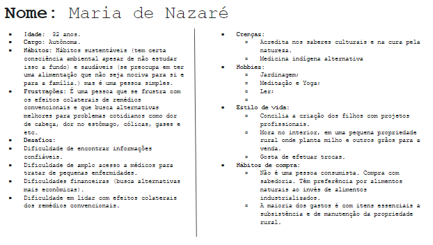
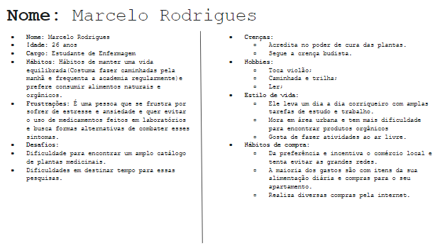
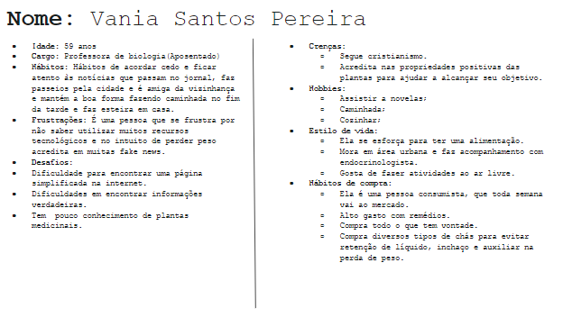
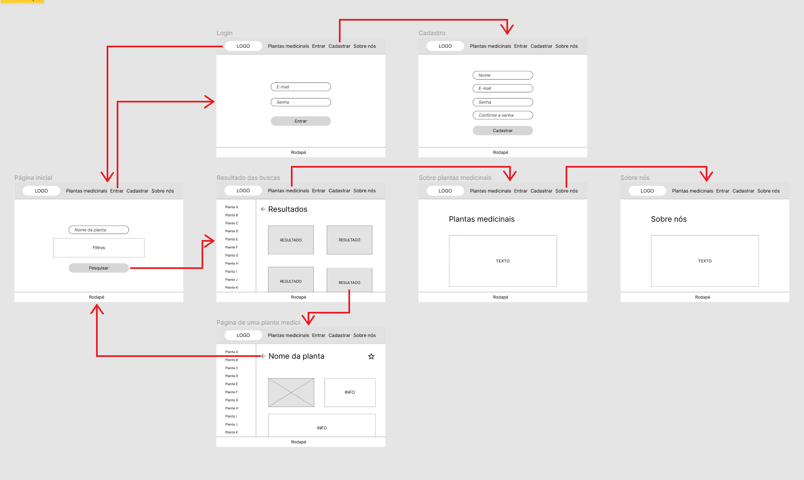
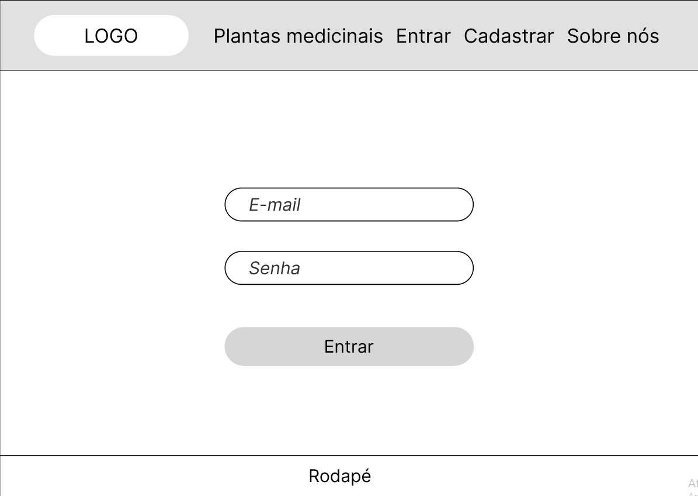
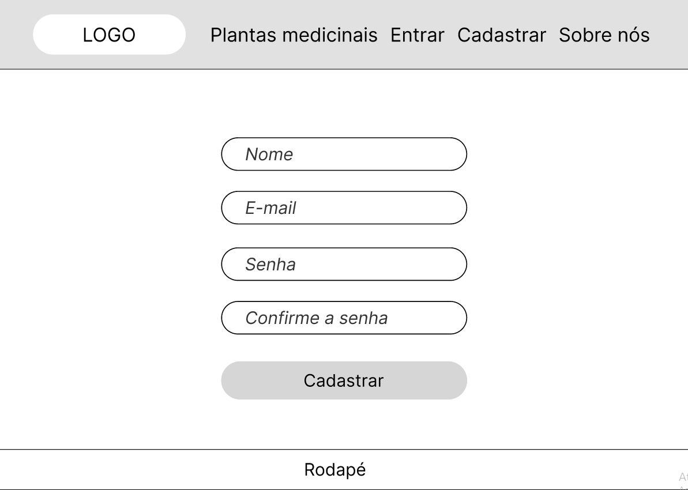
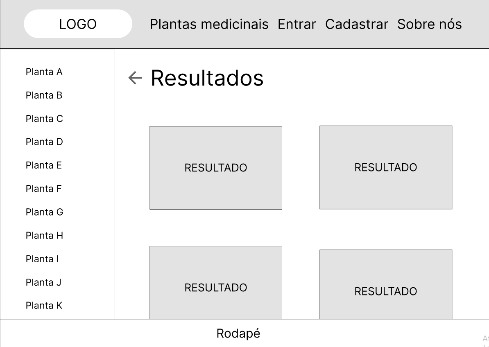
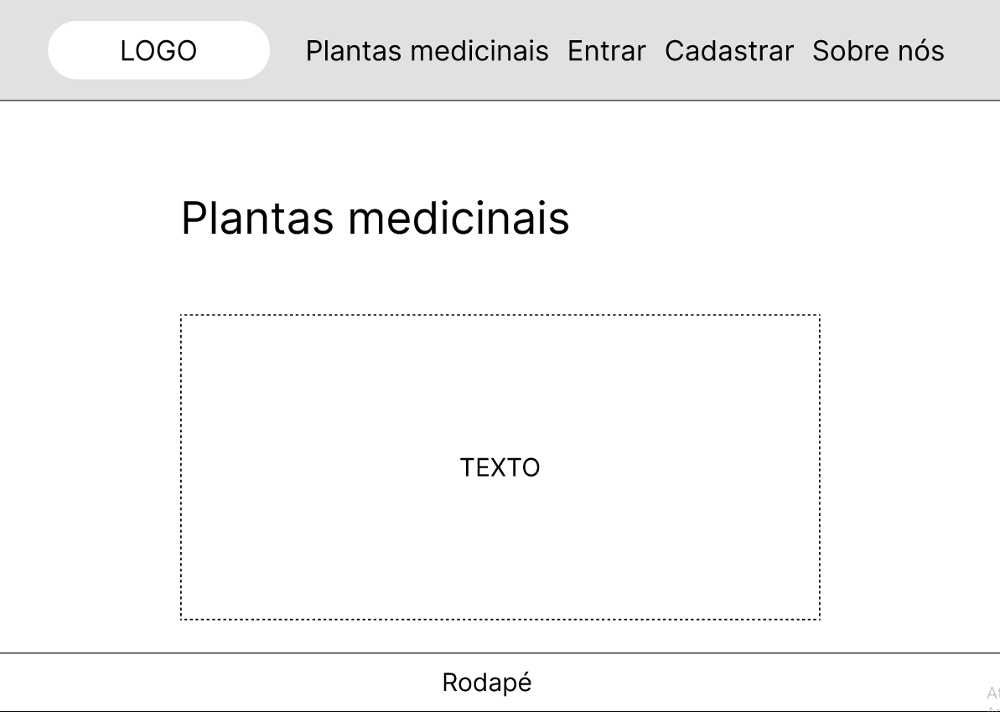
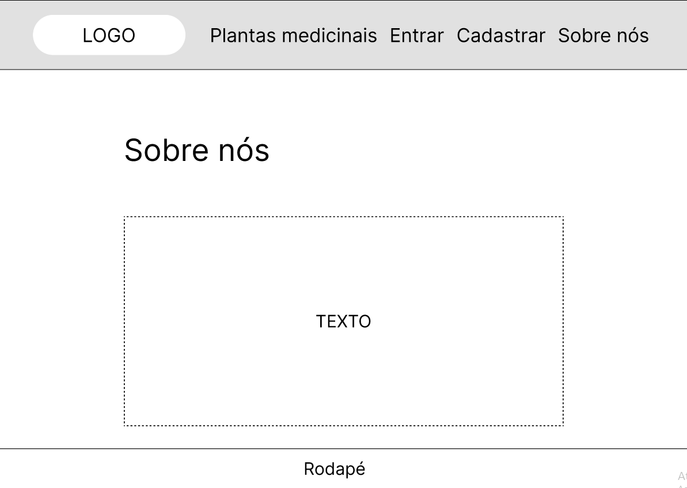
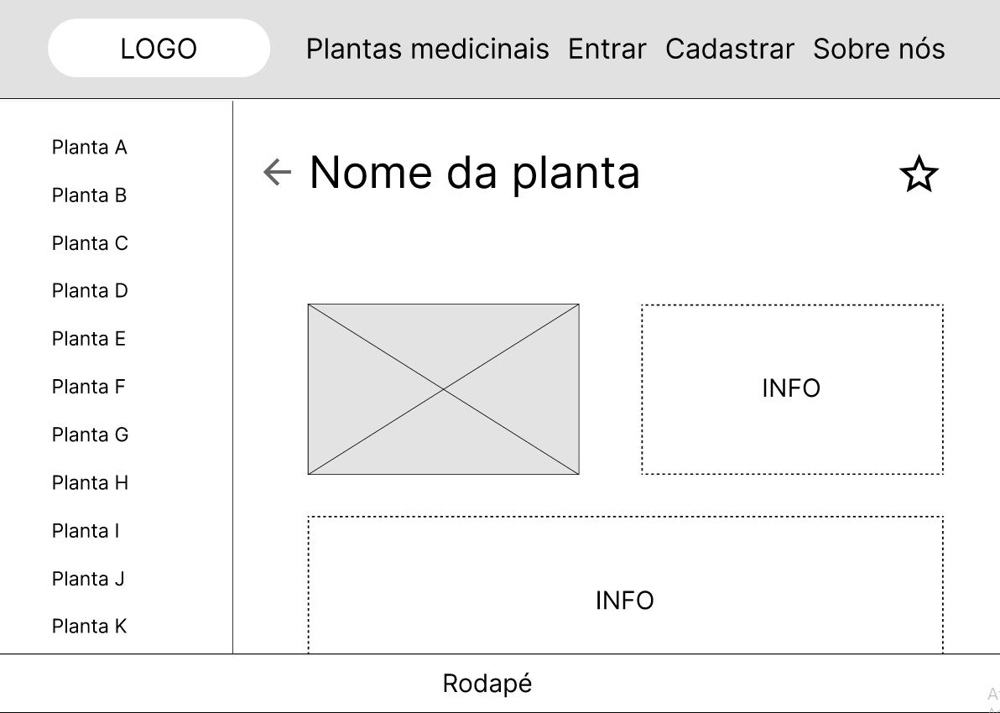

# Informações do Projeto
`TÍTULO DO PROJETO`  

...... FITOTERÁPICA ......

`CURSO` 

...... SISTEMAS DE INFORMAÇÃO ......

## Participantes

......  Ana Júlia Dias Aguiar  ......

......  Gabriel Ferreira Marques Mendes  ......

......  Leonardo Maia Assis Oliveira  ......

......  Misael Oliveira Pereira  ......

......  Pedro Henrique Alves de Souza  ......

......  Raphael Henrique Oliveira Santos  ......

# Estrutura do Documento

- [Informações do Projeto](#informações-do-projeto)
  - [Participantes](#participantes)
- [Estrutura do Documento](#estrutura-do-documento)
- [Introdução](#introdução)
  - [Problema](#problema)
  - [Objetivos](#objetivos)
  - [Justificativa](#justificativa)
  - [Público-Alvo](#público-alvo)
- [Especificações do Projeto](#especificações-do-projeto)
  - [Personas e Mapas de Empatia](#personas-e-mapas-de-empatia)
  - [Histórias de Usuários](#histórias-de-usuários)
  - [Requisitos](#requisitos)
    - [Requisitos Funcionais](#requisitos-funcionais)
    - [Requisitos não Funcionais](#requisitos-não-funcionais)
  - [Restrições](#restrições)
- [Projeto de Interface](#projeto-de-interface)
  - [User Flow](#user-flow)
  - [Wireframes](#wireframes)
- [Metodologia](#metodologia)
  - [Divisão de Papéis](#divisão-de-papéis)
  - [Ferramentas](#ferramentas)
  - [Controle de Versão](#controle-de-versão)
- [**############## SPRINT 1 ACABA AQUI #############**](#-sprint-1-acaba-aqui-)
- [Projeto da Solução](#projeto-da-solução)
  - [Tecnologias Utilizadas](#tecnologias-utilizadas)
  - [Arquitetura da solução](#arquitetura-da-solução)
- [Avaliação da Aplicação](#avaliação-da-aplicação)
  - [Plano de Testes](#plano-de-testes)
  - [Ferramentas de Testes (Opcional)](#ferramentas-de-testes-opcional)
  - [Registros de Testes](#registros-de-testes)
- [Referências](#referências)

# Introdução

Plantas medicinais e recursos minerais são utilizados como prática muito antes da humanidade se reconhecer como tal. Uma pesquisa publicada na revista Nature por Laura
Weyrich, revela que os neandertais utilizavam a Populus trichocarpa como tratamento para a dor de cabeça devido a suas ações analgésicas pela presença do ácido salicílico. 
Enquanto as culturas europeias iniciavam a sua formação, a medicina tradicional indiana ayurveda e chinesa já estavam consolidadas há milhares de anos. Segundo o Caderno de 
Práticas integrativas e complementares na Atenção Básica/Ministério da Saúde: as plantas medicinais e fitoterapia, desde o século 200a.c, já eram catalogadas pelos 
imperadores chineses, tendo-se, atualmente, como “referência mais completa sobre prescrição de ervas chinesas a enciclopédia chinesa Modern Day, de matéria médica publicada 
em 1997, listando quase 6.000 medicamentos, dos quais 4.800 são de origem vegetal”.

No Brasil, a grande parte do conhecimento da medicina tradicional advém dos indígenas (LINDENMAIER e PUTZKE, 2011), são incontáveis saberes que passados de geração em 
geração somam conhecimento às comunidades tradicionais. No entanto, devido ao adentramento dos conhecimentos científicos europeus e o subjugamento dos saberes populares há 
um risco iminente na perda de conhecimento (ALMEIDA, 2011).

Desde 2006, no Brasil, em consonância com as normas definidas pela Organização Mundial da Saúde (OMS) sobre medicinas tradicionais e medicinas complementares e 
alternativas, o SUS dispõe nas Política de Práticas Integrativas e Complementares (PNPIC) recomendações, diretrizes e responsabilidades institucionais para a 
implementação/adequação de ações e serviços serviços de medicina tradicional chinesa/acupuntura, homeopatia, plantas medicinais e fitoterapia. Esse estabelecimento ocorre 
devido a grande utilização da medicina tradicional em território, cerca de 82% dos brasileiros utilizam de algum fitoterápico em seu dia a dia (DE SIMONI, 2008), desde a 
utilização de plantas comuns como hortelã a plantas de conhecimento familiar.

O Ministério da Saúde dispõe no Departamento de Atenção Básica. O Caderno de Práticas integrativas e complementares: plantas medicinais e fitoterapia na Atenção 
Básica/Ministério da Saúde, tratando dos assuntos relativos às práticas fitoterápicas em território nacional. Conforme o documento:

As plantas medicinais e seus derivados estão entre os principais recursos terapêuticos da MT/MCA e vêm, há muito, sendo utilizados pela população brasileira nos seus 
cuidados com a saúde, seja na Medicina Tradicional/Popular ou nos programas públicos de fitoterapia no SUS, alguns com mais de 20 a nos de existência. Entre as Práticas 
Integrativas E Complementares no SUS, as plantas medicinais e fitoterapia são as mais presentes no Sistema, segundo diagnóstico do Ministério da Saúde, e a maioria das 
experiências ocorrem na APS.

Nesse sentido, buscamos com esse trabalho solidificar por meio de uma plataforma web os conhecimentos de plantas medicinais tão esparsos e fornecê-los com qualidade à 
população brasileira.

## Problema

De acordo com o apresentado anteriormente, é notória a grande utilização de plantas medicinais pela população brasileira e a tentativa de regulamentação dos órgãos públicos 
para a homogeneização e controle da aplicação da medicina tradicional em território nacional. No entanto, ainda sim enfrentamos problemas quanto ao acesso de conhecimento 
quando o assunto é a implementação pelos governos no acesso a informação de forma segura, confiável e objetiva sobre o uso de fitoterápicos. A existência de toxicidade na 
utilização de fitoterápicos se configura também como um problema de grande importância em seu uso. S. S. Campos apresenta a seguinte dissertação:

As plantas produzem uma grande variedade de substâncias químicas que podem apresentar diversas atividades biológicas e constituem ainda hoje um recurso terapêutico 
relevante para uma parcela significativa da população mundial que não tem acesso aos medicamentos industrializados (Tôrres et al., 2005). Existe uma percepção na população 
que o uso de plantas no tratamento de doenças é natural, seguro, barato e eficaz, sendo essas, muitas vezes, utilizadas no tratamento de doenças crônicas associadas com 
medicamentos convencionais (Tovar & Petzel, 2009). No entanto, a utilização de plantas na terapêutica e na alimentação deve ser restrita a plantas conhecidas e/ou 
corretamente identificadas (Colombo et al., 2010), pois podem ocorrer intoxicações com o uso de espécies vegetais, provocando graves acidentes.

Segundo uma pesquisa publicada por SIMONI et al na Revista Brasileira Saúde da Família, dos 4051 municípios entrevistados, apenas 350 (9%) possuíam Práticas Integrativas 
Complementares implementadas quanto ao uso seguro e racional de fitoterápicos. Nesse sentido, nota-se que 90% do grupo amostral, que representa 72% da quantidade de 
municípios brasileiros, não possuem práticas integrativas suficientes para a garantia do uso comunitário seguro de plantas medicinais. Quando se observa as outras práticas 
medicinais tradicionais como a chinesa e indiana, há uma menor porcentagem de cobertura em PIC, ou seja, a oferta governamental se torna deficiente quando o assunto é a 
garantia do acesso à informação.

## Objetivos

O presente trabalho traz como objetivos gerais:

Garantir o acesso às informações sobre plantas medicinais;
Garantia de confiabilidade no acesso de informação;
Preservação do conhecimento medicinal tradicional;

O presente trabalho traz como objetivos específicos:
Democratização do conhecimento científico e tradicional de plantas medicinais;
Fomento do uso de fitoterápicos de forma segura;
Renovação na apresentação das informações de plantas medicinais;

## Justificativa

O trabalho em vigência investigará as diversas bibliografias dispostas por órgãos regulamentadores como o Ministério da Saúde e publicações científicas relevantes para a 
construção de uma base de dados consistente, confiável e objetiva a fim de apresentar aos usuários de plantas medicinais informações de cunho verídico para promover um 
consumo consciente e correto das plantas medicinais.

A toxicidade e contra indicações de uso ainda são um mistério em diversos usos e quantidades ineficientes ou abusivas de plantas podem levar a efeitos indesejados durante o 
tratamento. Nesse sentido, o nosso trabalho justifica-se também na pauta de levar a população brasileira um acesso democratizado e confiável quanto aos problemas 
relacionados à toxicidade, uso correto e aplicação de fitoterápicos em tratamentos de enfermidades.

## Público-Alvo

O público alvo é formado por homens e mulheres, de 25 a 60 anos, com atuação na área de biológicas, de classe baixa ou média e com hábitos sustentáveis.
 
# Especificações do Projeto

Foi feita uma reunião pelo Microsoft Teams para que o grupo definisse em conjunto cada especificação.

## Personas e Mapas de Empatia

## Histórias de Usuários

Com base na análise das personas forma identificadas as seguintes histórias de usuários:

|EU COMO... `PERSONA`| QUERO/PRECISO ... `FUNCIONALIDADE` |PARA ... `MOTIVO/VALOR`                 |
|--------------------|------------------------------------|----------------------------------------|
|Maria               |Consultar as plantas medicinais típicas de cada região           |Encontrar as próximas a mim|
|Maria               |Visualizar as imagens das plantas   |Conferir as quais eu possuo      |
|Marcelo             | Poder filtrar a consulta de plantas medicinais | Poder entender quais são utilizadas em cada caso|
|Marcelo             | Poder pesquisar em um site confiáveis | Evitar de ser afetado por fake news|
|Vânia               | Pesiquisar em sites de interfaces simples             |   Uso facilitado|
|Vânia               | Marcar plantas como favoritas |Acessar historico de plantas mais fácil|

## Requisitos

As tabelas que se seguem apresentam os requisitos funcionais e não funcionais que detalham o escopo do projeto.

### Requisitos Funcionais

|ID    | Descrição do Requisito  | Prioridade |
|------|-----------------------------------------|----|
|RF-001| Filtrar consulta de plantas por nome. | ALTA | 
|RF-002| Filtrar consulta de plantas por utilidade.  | ALTA |
|RF-003| Filtrar consulta de plantas por região. | ALTA |
|RF-004| Realizar cadastro de usuário. | MÉDIA |
|RF-005| Realizar login de usuário. | MÉDIA |
|RF-006| Realizar logout de usuário. | BAIXA |
|RF-007| Visualização da descrição e das imagens de cada planta. | ALTA |
|RF-008| Adicionar uma planta aos favoritos. | MÉDIA |
|RF-009| Exibir lista das plantas adicionadas aos favoritos. | MÉDIA |
|RF-010| Exibir alerta reforçando a não recomendação do uso das plantas a cada 24h. | ALTA |

### Requisitos não Funcionais

|ID     | Descrição do Requisito  |Prioridade |
|-------|-------------------------|----|
|RNF-001| O desenvolvimento deve ser feito com a linguagem TypeScript | ALTA | 
|RNF-002| O front-end deve ser desenvolvido com a biblioteca ReactJS |  ALTA | 
|RNF-003| Os dados devem ser servidos ao front-end por meio do JSON Server |  MÉDIA | 

## Restrições

O projeto está restrito pelos itens apresentados na tabela a seguir.

|ID| Restrição                                             |
|--|-------------------------------------------------------|
|01| Quantidade de plantas que estarão disponíveis para consulta limitada em aproximadamente 60. |
|02| Prazo de entrega das sprints. |

# Projeto de Interface

## User Flow

## Wireframes

# Metodologia

No presente trabalho serão apresentadas metodologias de pesquisa bibliográfica levantando de três base de dados diferentes: o livro Tratado de plantas medicinais Tratado 
das plantas medicinais mineiras,nativas e cultivadas, Memento Fitoterápico Farmacopéia Brasileira e Formulário de Fitoterápicos Farmacopéia Brasileira. Os dados serão 
extraídos de acordo com a seguinte ficha de coleta apresentada abaixo. Após a coleta e refinamento de informações, os dados serão inseridos na base de dados da aplicação. 

## Divisão de Papéis

Misael - Controle de Versionamento e CodeReview

Leonardo - Documentação e Json Server

Pedro - JsonServer e Organização de tarefas Trello

Ana e Gabriel - Desenvolvedores

Raphael - 

## Ferramentas

| Ambiente  | Plataforma              |Link de Acesso |
|-----------|-------------------------|---------------|
|Processo de Design Thinkgin  | Trello | https://trello.com/b/iA8Uqx5h/kanban-fitoter%C3%A1pica | 
|Repositório de código | GitHub | https://github.com/PBE-TIAW-2022-1/tiaw-pbe-20221-MisaelOPereira/ | 
|Protótipo Interativo | Figma | https://www.figma.com/proto/1HQIPyMGnSMhmf5nOxpnkh/Projeto-de-interface?node-id=1%3A2&scaling=contain&page-id=0%3A1&starting-point-node-id=1%3A2 |
|Plataforma de reuniões| Microsoft Teams | https://teams.microsoft.com | 
|Editor de Código| Visual Studio Code | https://code.visualstudio.com/ | 
|Criação de Logo| Canavas | https://www.canva.com/ | 

## Controle de Versão

Na plataforma GitHub criamos um repositório com duas branchs, master e develop. Os desenvolvedores do grupo criarão branchs a partir da develop e realizarão pull requests 
nela. No final do projeto, a develop, após a revisão de código, será fundida a master.

# **############## SPRINT 1 ACABA AQUI #############**

# Projeto da Solução

......  COLOQUE AQUI O SEU TEXTO ......

## Tecnologias Utilizadas

......  COLOQUE AQUI O SEU TEXTO ......

> Descreva aqui qual(is) tecnologias você vai usar para resolver o seu
> problema, ou seja, implementar a sua solução. Liste todas as
> tecnologias envolvidas, linguagens a serem utilizadas, serviços web,
> frameworks, bibliotecas, IDEs de desenvolvimento, e ferramentas.
> Apresente também uma figura explicando como as tecnologias estão
> relacionadas ou como uma interação do usuário com o sistema vai ser
> conduzida, por onde ela passa até retornar uma resposta ao usuário.
> 
> Inclua os diagramas de User Flow, esboços criados pelo grupo
> (stoyboards), além dos protótipos de telas (wireframes). Descreva cada
> item textualmente comentando e complementando o que está apresentado
> nas imagens.

## Arquitetura da solução

......  COLOQUE AQUI O SEU TEXTO E O DIAGRAMA DE ARQUITETURA .......

> Inclua um diagrama da solução e descreva os módulos e as tecnologias
> que fazem parte da solução. Discorra sobre o diagrama.
> 
> **Exemplo do diagrama de Arquitetura**:
> 
> 

# Avaliação da Aplicação

......  COLOQUE AQUI O SEU TEXTO ......

> Apresente os cenários de testes utilizados na realização dos testes da
> sua aplicação. Escolha cenários de testes que demonstrem os requisitos
> sendo satisfeitos.

## Plano de Testes

......  COLOQUE AQUI O SEU TEXTO ......

> Enumere quais cenários de testes foram selecionados para teste. Neste
> tópico o grupo deve detalhar quais funcionalidades avaliadas, o grupo
> de usuários que foi escolhido para participar do teste e as
> ferramentas utilizadas.
> 
> **Links Úteis**:
> - [IBM - Criação e Geração de Planos de Teste](https://www.ibm.com/developerworks/br/local/rational/criacao_geracao_planos_testes_software/index.html)
> - [Práticas e Técnicas de Testes Ágeis](http://assiste.serpro.gov.br/serproagil/Apresenta/slides.pdf)
> -  [Teste de Software: Conceitos e tipos de testes](https://blog.onedaytesting.com.br/teste-de-software/)

## Ferramentas de Testes (Opcional)

......  COLOQUE AQUI O SEU TEXTO ......

> Comente sobre as ferramentas de testes utilizadas.
> 
> **Links Úteis**:
> - [Ferramentas de Test para Java Script](https://geekflare.com/javascript-unit-testing/)
> - [UX Tools](https://uxdesign.cc/ux-user-research-and-user-testing-tools-2d339d379dc7)

## Registros de Testes

......  COLOQUE AQUI O SEU TEXTO ......

> Discorra sobre os resultados do teste. Ressaltando pontos fortes e
> fracos identificados na solução. Comente como o grupo pretende atacar
> esses pontos nas próximas iterações. Apresente as falhas detectadas e
> as melhorias geradas a partir dos resultados obtidos nos testes.

# Referências

......  COLOQUE AQUI O SEU TEXTO ......

> Inclua todas as referências (livros, artigos, sites, etc) utilizados
> no desenvolvimento do trabalho.
> 
> **Links Úteis**:
> - [Formato ABNT](https://www.normastecnicas.com/abnt/trabalhos-academicos/referencias/)
> - [Referências Bibliográficas da ABNT](https://comunidade.rockcontent.com/referencia-bibliografica-abnt/)
